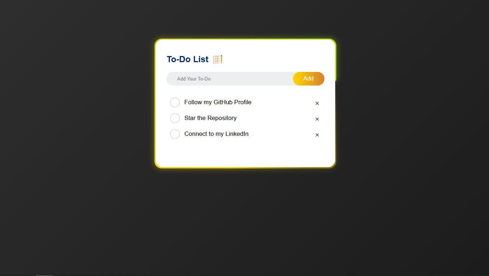

# ✅ To-Do List Web App

A clean and responsive **To-Do List App** built using **HTML, CSS & JavaScript**.  
Manage your tasks with a user-friendly interface and zero distractions.

---
## 📸 Screenshot

---

## 🌐 Live Demo

- 🔗 [Click to See Live Demo!](https://deeps1970.github.io/Todo-List/) 

---

## 📋 Features

- 📝 Add new tasks instantly  
- ❌ Delete tasks one by one  
- ✔️ Simple check-circle UI for status  
- 💻 Fully responsive on all screen sizes  
- 🎨 Beautiful gradient background & modern design

---

## ⚙️ Tech Stack

- **HTML5**  
- **CSS3**  
- **JavaScript**
  
---

## 🧠 What I Learned

- DOM manipulation using JS  
- Event handling (add, delete)  
- Responsive layout techniques  
- Minimalistic UI styling 

---

## 📣 Connect with Me

🔗 **GitHub :** [Deeps1970](https://github.com/Deeps1970)  
🔗 **LinkedIn :** [deepak1970](https://linkedin.com/in/deepak1970)

---

## ⭐️ Show Support

If you liked it, give it a ⭐️ and connect with me!

---

## 📄 License

This project is licensed under the **MIT License.**

---
